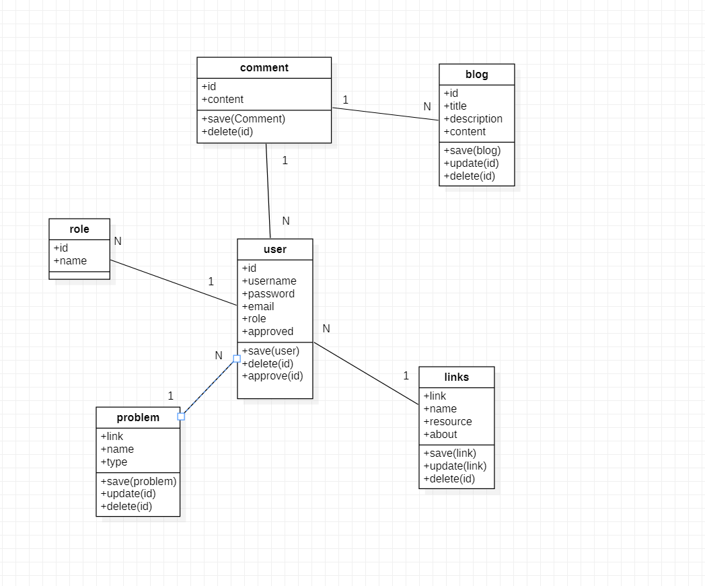
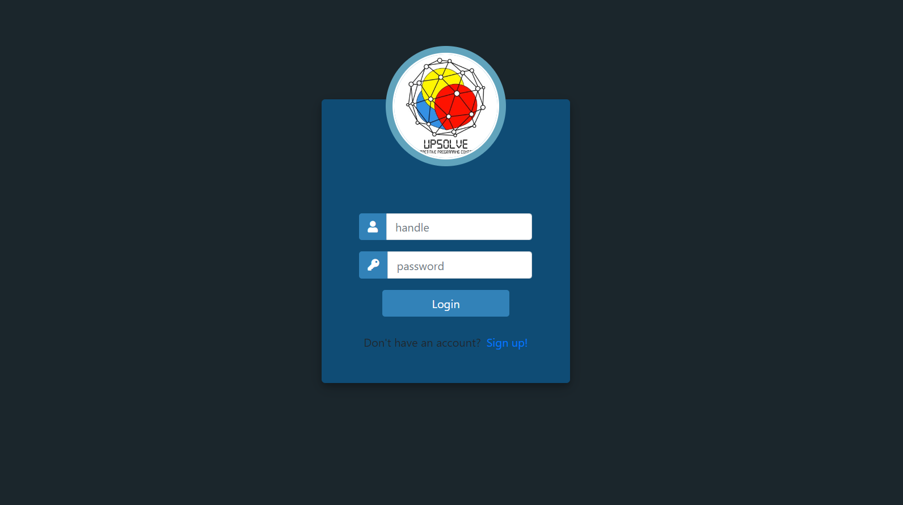
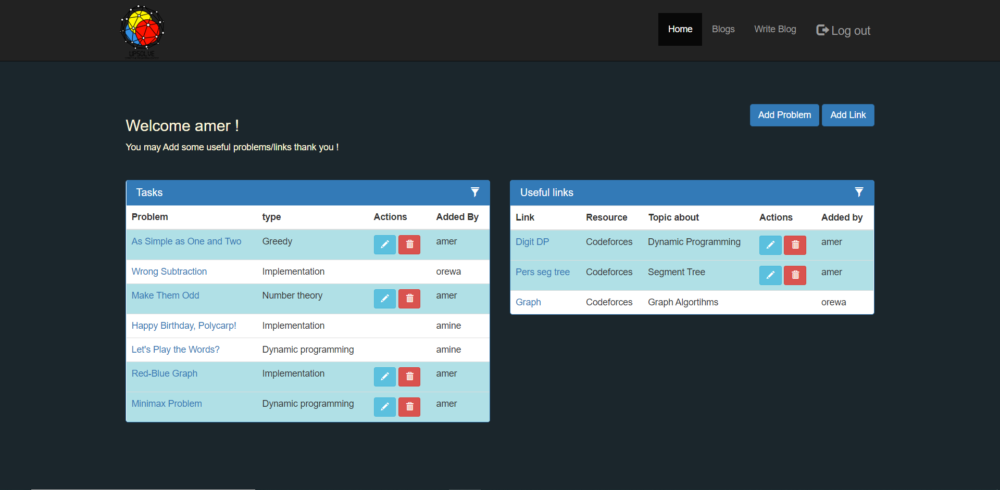
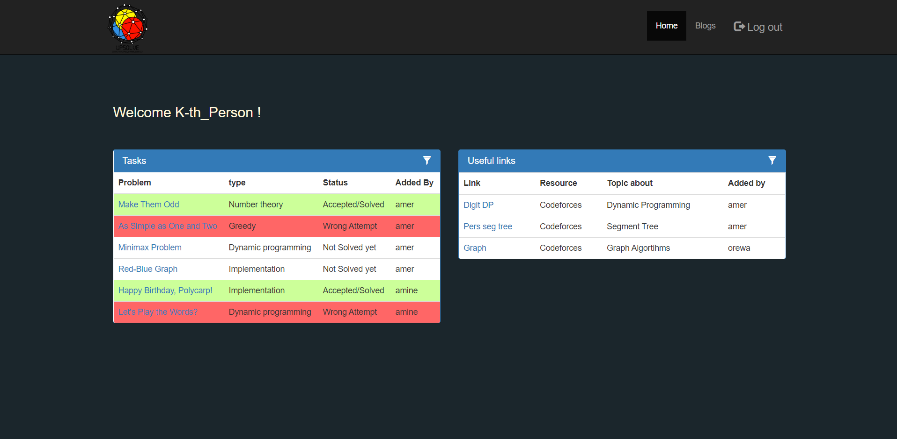
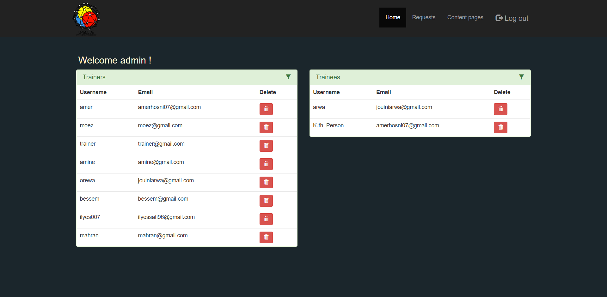
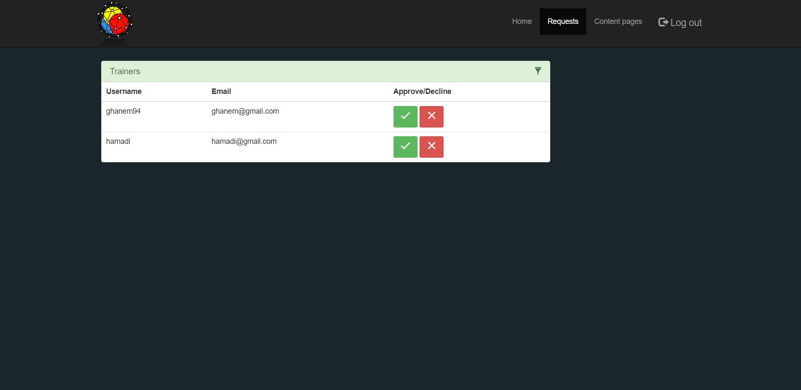
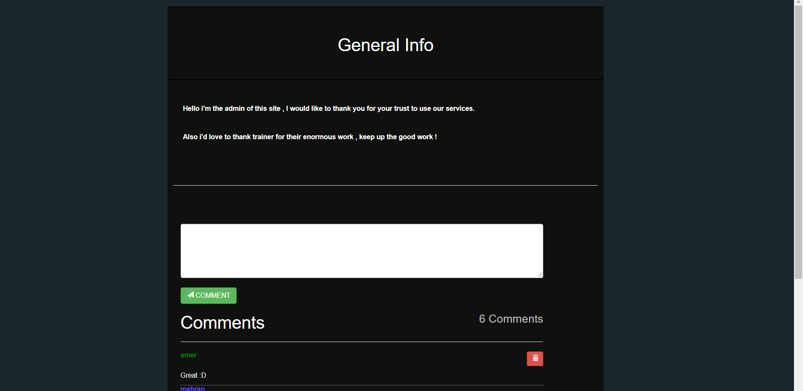

# Upsolve

**This is a competitive programming training manager interface , built using :**
  - Spring boot
  - MysQL
  - Bootstrap
  - Quill js
  
 ## Diagram class: 
 
 
 **Main actors :**
  -Admin (Manage Users and has all privileges)
  -Trainer (Manage the training adding problems , usefull links and blogs ..)
  -Trainee (Consult pages and comment blogs)

## Login page :

## Trainer interface :

## Trainee interface :

## Admin interface :

  ### Home page:
  

  ### Requests (Trainers asks to be approved for training)
  
  
## Blog page Example:

